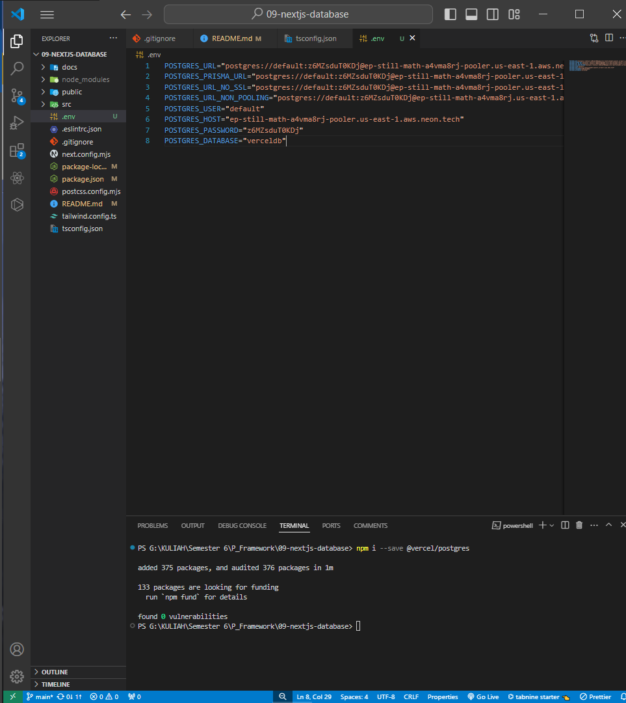

> **FARHAN DWI PRAMANA**
>
> 3C / 04
>
> 2141720125

# SETUP DATABASE dan FECTHING DATA di NEXTJS

### Praktikum 1: Setup Database

#### Soal 1 : Jelaskan apa yang telah Anda pelajari?

Memanfaatkan vercel untuk mendeploy sebuah proyek yang ada pada repository yang hanya dipilih saja untuk dilakukan deploy.

#### Soal 2 : Jelaskan apa yang telah Anda pelajari?

Fitur lain dari vercel yaitu berupa pembuatan database, di praktikum ini contoh pembuatan database menggunakan Postgre dari vercel. Untuk mengakses database postgre dari vercel ini diperlukan atau harus membuat file .env yang isinya berupa kode-kode rahasia yang berupa API dan harus dibuat di file .gitignore agar kode rahasia tersebut tidak ikut terpush ke github
