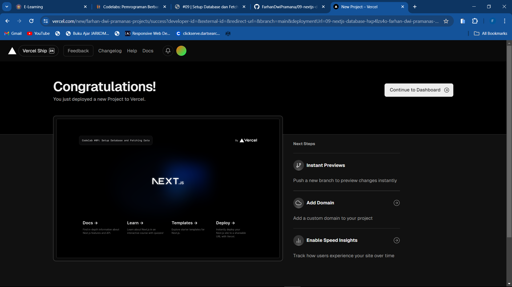
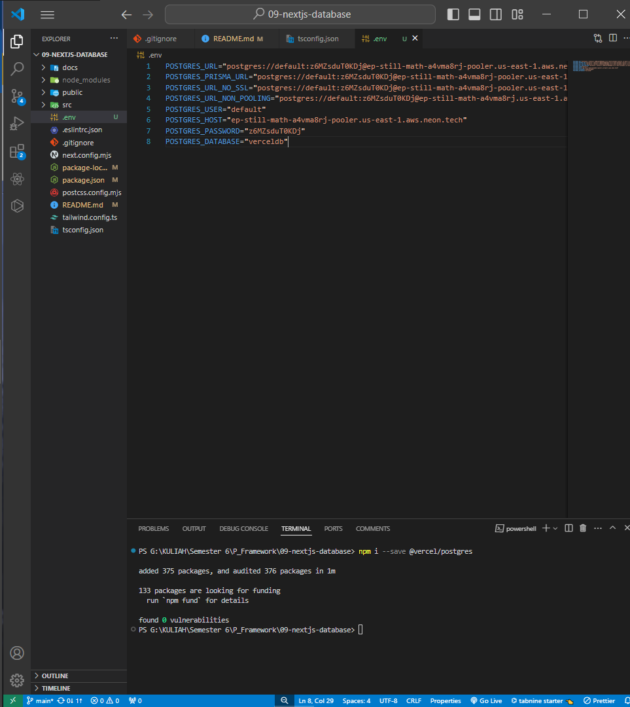
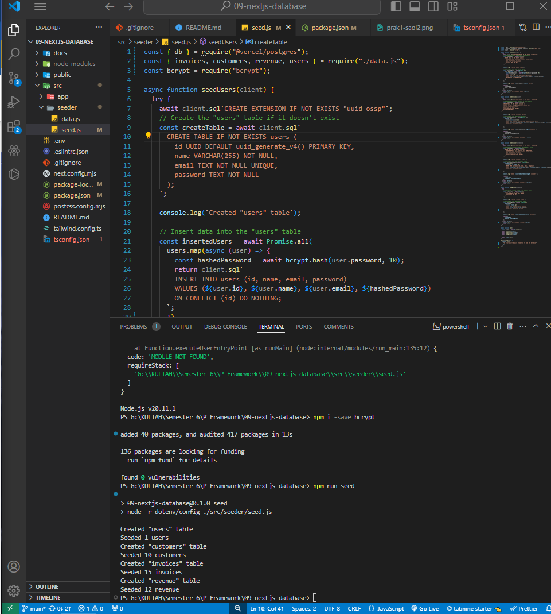
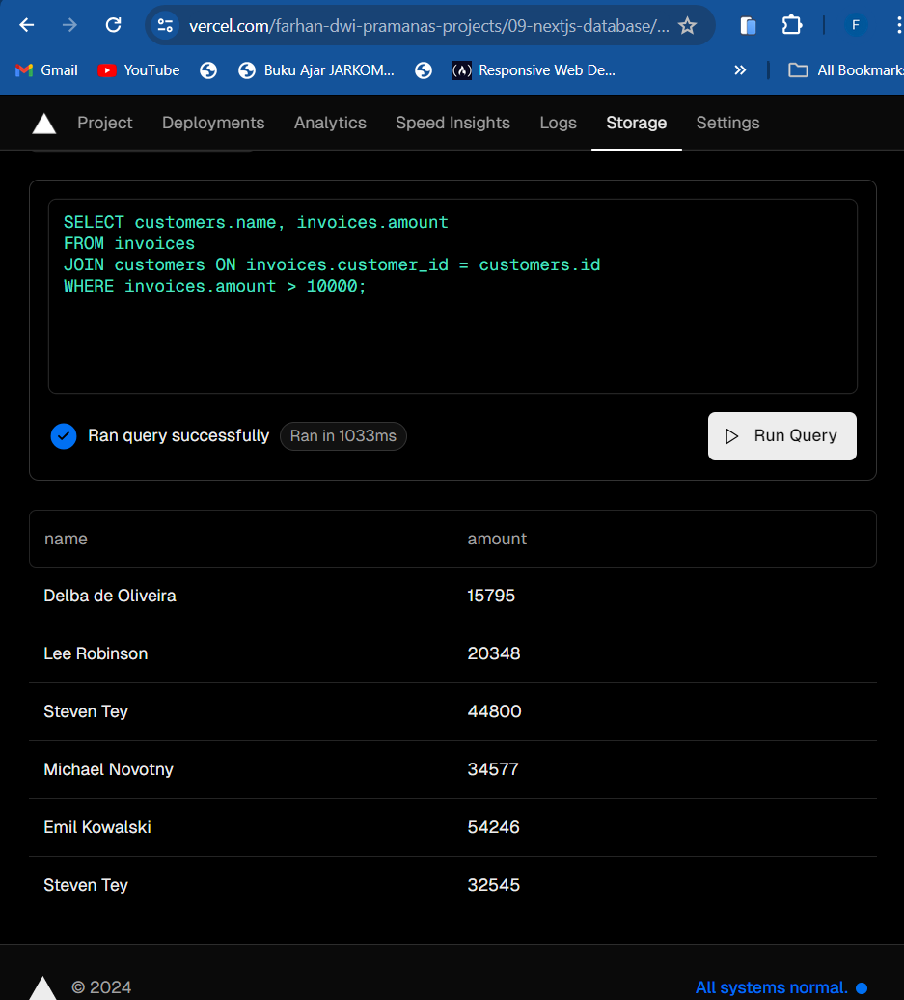
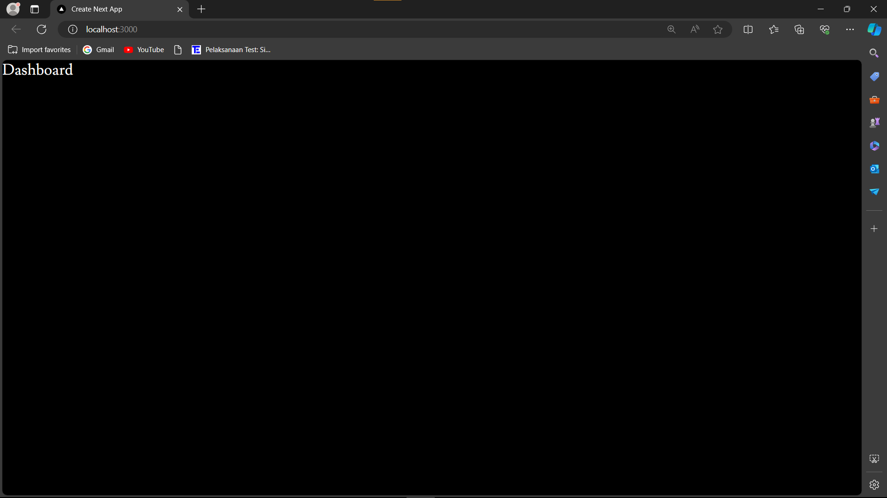
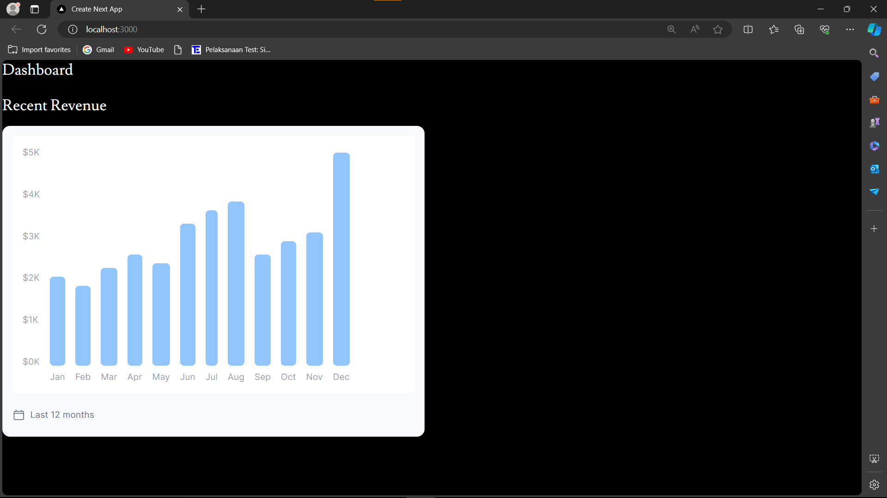
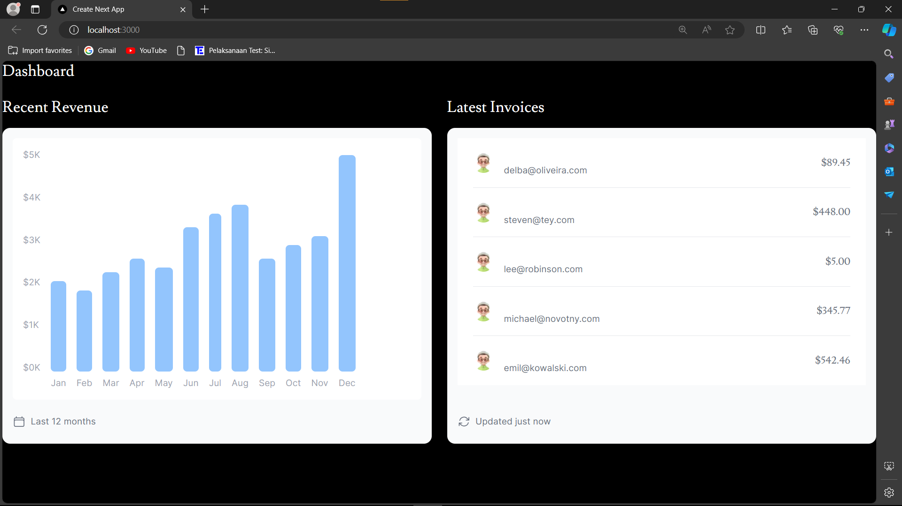
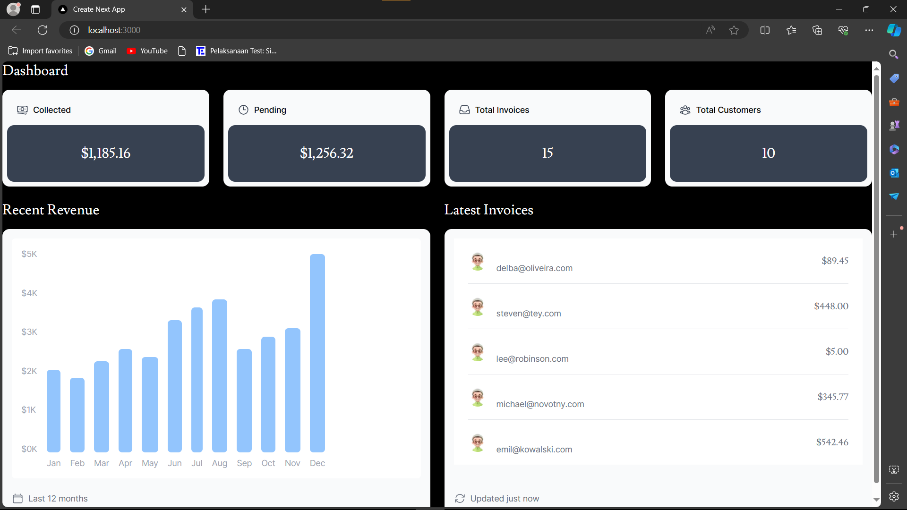

> **FARHAN DWI PRAMANA**
>
> 3C / 04
>
> 2141720125

# SETUP DATABASE dan FECTHING DATA di NEXTJS

### Praktikum 1: Setup Database

#### Soal 1 : Jelaskan apa yang telah Anda pelajari?



Memanfaatkan vercel untuk mendeploy sebuah proyek yang ada pada repository yang hanya dipilih saja untuk dilakukan deploy.

#### Soal 2 : Jelaskan apa yang telah Anda pelajari?



Fitur lain dari vercel yaitu berupa pembuatan database, di praktikum ini contoh pembuatan database menggunakan Postgre dari vercel. Untuk mengakses database postgre dari vercel ini diperlukan atau harus membuat file .env yang isinya berupa kode-kode rahasia yang berupa API dan harus dibuat di file .gitignore agar kode rahasia tersebut tidak ikut terpush ke github

#### Soal 3 : Jelaskan apa yang telah Anda pelajari?



Mencoba menginputkan sebuah data dan tabel ke dalam database yang telah dibuat melalui file seed.js, selain itu mencoba untuk menentukan dat aapa saja yan akan diinputkan ditiap tabel yang akan dibuat di file data.js

#### Soal 4 : Jelaskan apa yang telah Anda pelajari ? Cobalah eksekusi query SQL yang lain sesuai kreasi Anda, capture hasilnya dan jelaskan!



Query SQL tersebut mengambil nilai amount dan name dari tabel invoices dan customers secara bersamaan berdasarkan kondisi invoices.amount = 666. Ini dilakukan dengan menggabungkan data dari kedua tabel menggunakan kolom customer_id dan id yang sesuai.


Sama seperti query sebelumnya hanya saja kondisinya berbeda yaitu dimana data ditampilkan yang hanya memiliki amount diatas 10000

### Praktikum 2: Fetching Data (API)

#### Soal 5 : Capture dan lampirkan link aplikasi Anda yang telah berhasil di deploy, kemudian buatlah laporan di file README.md. Jelaskan apa yang telah Anda pelajari ?



[link](http://localhost:3000/)

Pertama, mendefinisikan struktur data melalui model untuk setiap tabel. Kemudian, menggunakan model query untuk mengakses data dari database dan memprosesnya sebelum ditampilkan di laman. Selanjutnya, membuat komponen dan laman yang diperlukan, tetapi tunda tampilan data sampai laman dapat dijalankan untuk mencegah error. Setelah komponen selesai, perbarui halaman utama (page.tsx) agar dapat menampilkan komponen yang telah dibuat saat server dijalankan.

#### Soal 6 : Lakukan capture dan push hasilnya, kemudian buatlah laporan di file README.md. Jelaskan apa yang telah Anda pelajari ?



Menampilkan grafik yang telah dibuat pada file revenue-chart.tsx yang berada di folder moleculs, kemudian memanggil function RevenueChart yang berada pada revenue-chart.tsx di file page.tsx dengan cara dilakukan import

#### Soal 7 : Lakukan capture dan push hasilnya, kemudian buatlah laporan di file README.md. Jelaskan apa yang telah Anda pelajari ?



Menampilkan semua data yang berada di tabel invoices yang mengambil di database kemudian menampilkannya.

### Tugas Praktikum

#### Soal 1 : Jika Anda perhatikan pada file src\app\page.tsx untuk komponen Card sebenarnya telah dibuat sebagai molecules pada file src\app\components\molecules\card.tsx yaitu komponen CardWrapper.



#### Soal 2 : Perhatikan fungsi fetchCardData() (pada file src\model\query.tsx) dari soal nomor 1. Jelaskan maksud kode dan kueri yang dilakukan dalam fungsi tersebut!

```
const invoiceCountPromise = sql`SELECT COUNT(_) FROM invoices`;
const customerCountPromise = sql`SELECT COUNT(_) FROM customers`;
const invoiceStatusPromise = sql`SELECT
    SUM(CASE WHEN status = 'paid' THEN amount ELSE 0 END) AS "paid",
    SUM(CASE WHEN status = 'pending' THEN amount ELSE 0 END) AS "pending"
    FROM invoices`;
```

Kode diatas merupakan query yang berguna untuk menghitung banyak nya data pada tabel invoices dan customers yang akan disimpan pada sebuah variabel invoiceCountPromise dan customerCountPromise, kemudian untuk variabel invoiceStatusPromise digunakan untuk menyimpan hasil perhitungan total jumlah amount yang telah dibayar dengan status 'paid' dan total jumlah amount yang belum dibayar atau tertunda dengan status 'pending' yang kemudian menghasilkan menjadi dua kolom yaitu 'paid' dan 'kolom'

```
const data = await Promise.all([
    invoiceCountPromise,
    customerCountPromise,
    invoiceStatusPromise,
]);

```

Kode diatas digunakan untuk mengumpulkan data, dimana dengan menggunakan promise secara paralel (Promise.all) dan setiap promise berisikan query SQL yang mengambil data dari database, setelah promise selesai hasilnya akan dikumpulkan ke dalam array data

```
const numberOfInvoices = Number(data[0].rows[0].count ?? "0");
const numberOfCustomers = Number(data[1].rows[0].count ?? "0");
const totalPaidInvoices = formatCurrency(data[2].rows[0].paid ?? "0");
const totalPendingInvoices = formatCurrency(data[2].rows[0].pending ?? "0");

```

1. Kode didalam numberOfInvoices dan numberOfCustomers digunakan untuk mengambil nilai 'count' dari hasil query pertama yaitu invoiceCountPromise dan dari hasil query kedua yaitu customerCountPromise yang telah dijalankan dan nilai nya nya akan dilakukan konversi tipe datanya menjadi number. Jika nilai 'count' tidak tersedia, maka otomatis akan diberikan nilai default yaitu '0'
2. Kode didalam totalPaidInvoices dan totalPendingInvoices digunakan untuk mengambil nilai 'paid' dari hasil query ketiga yaitu invoicesStatusPromise yang telah dijalankan dan mengambil nilai 'pending' dari hasil query query yang sama, yang kemudian akan dikeonversikan hasilnya ke dalam format angka.

```
catch (error) {
    console.error("Database Error:", error);
    throw new Error("Failed to fetch card data.");
}
```

Kode diatas digunakan untuk menangani ketika didalam kode try terjadi error, dan akan menampilkan pesan berupa "Database Error: ...", serta untuk kode throw new error yaitu digunakan untuk melempar error baru dengan "Failed to fetch card data"
